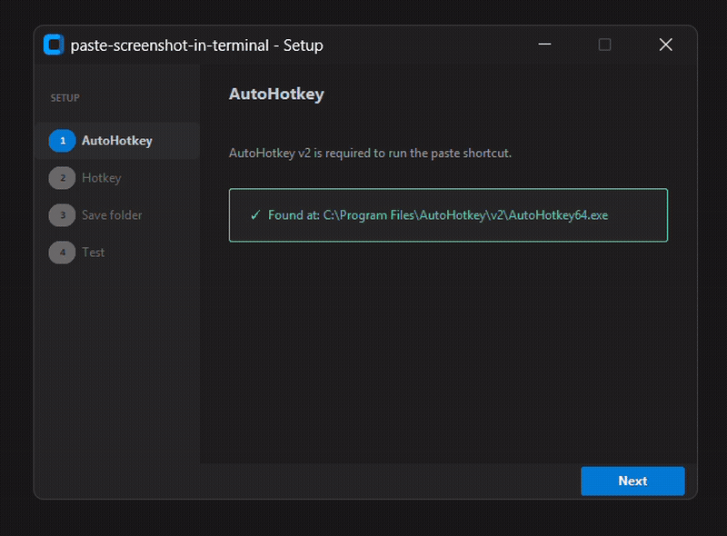

<div align="center">

# paste-screenshot-in-terminal

**Paste any clipboard image into your terminal as a file path - with a single hotkey.**

Built for [Claude Code](https://claude.ai/code) users and anyone who works with AI tools in the terminal.

[](LICENSE)
[](https://github.com/felipemnds/paste-screenshot-in-terminal/releases)
[](https://www.autohotkey.com/)
[](https://github.com/felipemnds/paste-screenshot-in-terminal/releases/latest)

<!-- Add a demo GIF here after recording. Recommended tool: ShareX or LICEcap -->
<!--  -->

</div>

---

## The problem

Terminals don't accept images - only text. So every time you want to share a screenshot with Claude Code (or any AI tool running in your terminal), you have to:

1. Take a screenshot
2. Find where it was saved
3. Manually copy the file path
4. Paste it into the terminal

**This tool turns all of that into one keystroke.**

---

## How it works

1. Copy any image to your clipboard - screenshot, browser right-click, snipping tool, anything
2. Switch to your terminal
3. Press **Ctrl+Shift+S** (or your custom hotkey)
4. The image is saved automatically and its path is typed into your terminal

That's it. Works with **any terminal**: PowerShell, Windows Terminal, CMD, Git Bash, Cmder, and more.

---

## Installation

### Option 1 - Setup wizard (recommended)

1. Download **`setup.exe`** from the [latest release](https://github.com/felipemnds/paste-screenshot-in-terminal/releases/latest)
2. Run it - no installation required, just double-click
3. Follow the 4-step wizard:
   - Checks if AutoHotkey is installed (and guides you through installing it if not)
   - Lets you record your preferred hotkey by pressing it
   - Lets you choose where temporary images are saved
   - Runs a live test so you can confirm everything works

### Option 2 - Manual setup

**Prerequisites:** [AutoHotkey v2](https://www.autohotkey.com/) installed

1. Clone or [download this repository](https://github.com/felipemnds/paste-screenshot-in-terminal/archive/refs/heads/master.zip)
2. Edit `config.ini` if needed:

```ini
[Settings]
Hotkey=^+s
SaveFolder=C:\Users\YourName\Documents\paste-screenshot-temp
```

3. Double-click `src/paste-screenshot.ahk` to start the script

---

## Features

- **Works in any terminal** - PowerShell, Windows Terminal, CMD, Git Bash, Cmder, and more
- **Any image source** - screenshots, browser images, snipping tool, clipboard from any app
- **Interactive setup wizard** - no config files to edit manually
- **Custom hotkey** - record your preferred shortcut by pressing it during setup
- **Auto-start with Windows** - optional, configured during setup
- **Lightweight** - a single AutoHotkey script, no background services

---

## Requirements

| Requirement | Details |
|---|---|
| OS | Windows 10 or Windows 11 |
| AutoHotkey | v2 (free - [download here](https://www.autohotkey.com/)) |

> **Note:** The `setup.exe` wizard runs without any dependencies. AutoHotkey is only needed to run the paste script itself.

---

## Usage

### Basic flow

```
Win+Shift+S              ← capture a region of your screen (Windows built-in)
[switch to terminal]
Ctrl+Shift+S             ← your hotkey: saves image + pastes path
```

**Example with Claude Code:**
```
> /path/to/screenshot_2025-01-15_14-30-00.png what does this diagram show?
```

### Hotkey syntax (for manual config)

| Symbol | Key |
|---|---|
| `^` | Ctrl |
| `+` | Shift |
| `!` | Alt |
| `#` | Win |

Example: `^+s` = Ctrl+Shift+S

---

## Project structure

```
paste-screenshot-in-terminal/
├── src/
│   └── paste-screenshot.ahk    ← main script
├── installer/
│   └── setup.ahk               ← setup wizard source
├── config.ini                  ← hotkey + folder config (generated by wizard)
├── LICENSE
└── README.md
```

---

## Temporary files

Images are saved with a timestamp (`screenshot_2025-01-15_14-30-00.png`) and never deleted automatically. Clear the folder manually whenever you want.

To change the folder, re-run the setup wizard or edit `config.ini` directly.

---

## Troubleshooting

**Hotkey does not work**
- Make sure `paste-screenshot.ahk` is running (check the system tray for the AutoHotkey icon)
- Another app may be using the same hotkey - run the wizard again to choose a different one

**"No image found in clipboard"**
- The script only works when there is an actual image in the clipboard, not a file path or text

**AutoHotkey version error**
- This script requires v2. If you have v1 installed, download v2 from [autohotkey.com](https://www.autohotkey.com/)

---

## Contributing

Issues and pull requests are welcome. If something doesn't work on your setup, please [open an issue](https://github.com/felipemnds/paste-screenshot-in-terminal/issues) with your Windows version and terminal app.

---

## License

MIT © [felipemnds](https://github.com/felipemnds)
